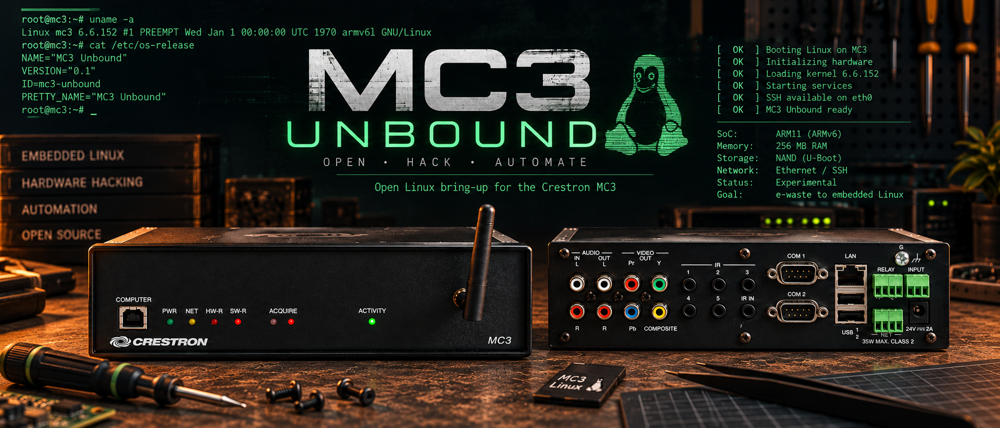

# MC3 Unbound

  

**Open Linux bring-up for the Crestron MC3 control processor.**
MC3 Unbound repurposes the Crestron MC3 as a small embedded Linux system, replacing the original Windows CE environment with U-Boot, a modern Linux kernel, device tree, and minimal userspace.

### Highlights

- Linux 6.6 running on the MC3's Freescale/NXP i.MX31 ARM11 processor
- Boots from the MC3's internal MicroSD card
- Ethernet and SSH working on development hardware
- MC3-specific U-Boot and device tree
- Minimal BusyBox userspace
- Active work on USB, serial, IR, relays, digital inputs, audio and video
- Hardware reverse engineering and documentation

> [!WARNING]
> This project is experimental: Use at your own risk. This project is an independent, community-developed project and is not affiliated with, endorsed by, sponsored by, or otherwise associated with Crestron Electronics, Inc. See other disclaimers below.

The Crestron MC3 is a 2011 era home automation controller that now turns up as e-waste or for ~$50 on eBay. Its single-core Freescale 532 MHz ARM11 processor and 256 MB of RAM put it roughly in Raspberry Pi 1 territory, but the built-in Ethernet, RS-232, IR, relays, digital inputs, RF, audio, and analog video hardware make it a useful Linux repurposing target. 

The MC3 originally ran Windows CE from an internal MicroSD card. MC3 Unbound enables Linux to run on this hardware by reflashing this card with Linux and the correct drivers and boot configuration.

## Current development status

MC3 Unbound has progressed from bootloader experiments to Linux running on development hardware, with Ethernet/SSH and minimal userspace exercised. Peripheral support remains under active development. Development results are not a release manifest: check the exact release artifact and its supported features before installation.

| Area | Evidence and current status |
| --- | --- |
| Linux kernel, device tree and initramfs | Hardware tested: integrated and booted on MC3 development hardware |
| Ethernet and SSH | Hardware tested on development builds; not a universal reliability guarantee |
| SD/MMC | Development boot/runtime exercised; historical driver and media limitations remain relevant |
| Shell tools | Minimal environment works; full shipped-applet/link audit and utility fixes remain next-build work |
| USB H2 and USB2514 internal hub | Software tested and independently reviewed within a bounded scope; physical USB remains unqualified |
| Video | Driver/initialization development exists; the tested video-disabled build provides no display output |

## Disclaimer

This project is provided “as is” and “as available,” without warranty of any kind, express or implied, including but not limited to warranties of merchantability, fitness for a particular purpose, accuracy, reliability, or non-infringement.

Use of this project is entirely at your own risk. To the maximum extent permitted by applicable law, the authors, contributors, and maintainers shall not be liable for any direct, indirect, incidental, special, consequential, or other damages or losses arising from the use of, inability to use, modification of, or reliance upon this project.

You are solely responsible for evaluating the suitability of this project for your intended use and for any effects its use may have on your hardware, software, systems, data, networks, or other property.

Crestron and the Crestron logo are either trademarks or registered trademarks of Crestron Electronics, Inc. in the United States and/or other countries. All other trademarks, product names, and company names referenced in this project are the property of their respective owners.

This project does not contain, incorporate or distribute any proprietary Crestron source code, firmware, or other Crestron intellectual property. Any references to Crestron products, protocols, interfaces, or trademarks are made solely for purposes of identification, interoperability, compatibility, research, and discussion.

No ownership of, or rights to, any Crestron trademark or other Crestron intellectual property are claimed or implied.
